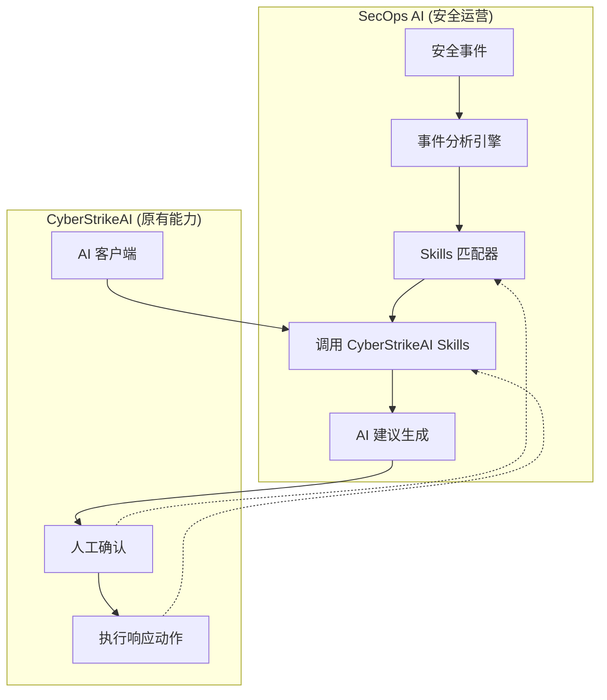
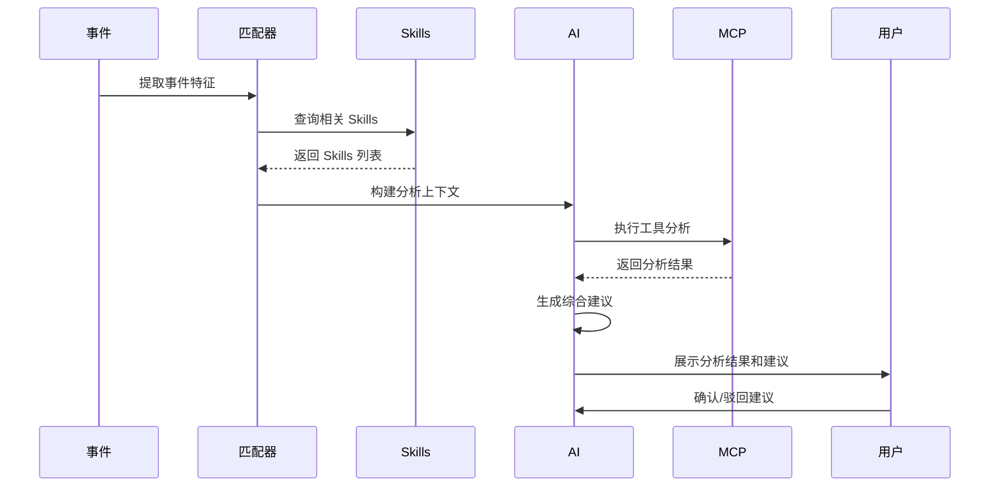
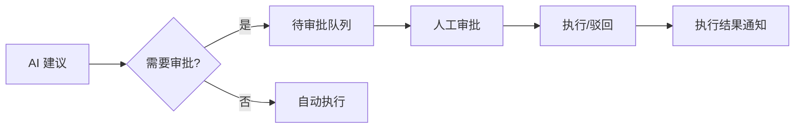

# SecOps AI 与 CyberStrikeAI 深度集成设计

## 1. 集成架构

### 1.1 整体架构



### 1.2 数据流

```
安全事件 → 事件类型识别 → 匹配 Skills → 调用 Skills 分析 
→ 调用 MCP 工具 → AI 综合分析 → 生成建议 → 人工确认 → 执行响应
```

---

## 2. Skills 集成设计

### 2.1 事件类型与 Skills 映射

| 事件类型 | 自动调用 Skills | 说明 |
|----------|-----------------|------|
| SQL注入特征 | sql-injection-testing | SQL注入测试 |
| XSS特征 | xss-testing | XSS测试 |
| 命令注入 | command-injection-testing | 命令注入测试 |
| 暴力破解 | network-penetration-testing | 渗透测试 |
| 恶意软件 | vulnerability-assessment | 漏洞评估 |
| API异常 | api-security-testing | API安全测试 |
| 未知类型 | incident-response | 应急响应通用 |

### 2.2 Skills 调用流程



---

## 3. MCP 工具集成

### 3.1 分析工具池

在事件分析过程中可调用的工具：

| 工具类别 | 工具示例 | 用途 |
|----------|----------|------|
| 网络扫描 | nmap, masscan | 资产探测 |
| Web扫描 | nikto, gobuster | 漏洞发现 |
| 漏洞扫描 | nuclei | 漏洞检测 |
| 域名枚举 | subfinder, amass | 攻击面分析 |
| 情报收集 | fofa, zoomeye | 威胁情报 |
| 取证分析 | volatility, forensics | 事件溯源 |

### 3.2 工具调用策略

- **自动调用**: AI 分析过程中根据上下文自动调用相关工具
- **工具结果处理**: 工具输出自动解析并纳入分析上下文
- **结果展示**: 工具执行结果以结构化方式展示

---

## 4. 响应动作设计

### 4.1 响应动作类型

| 动作 | 需要人工确认 | 说明 |
|------|-------------|------|
| 隔离主机 | 是 | EDR 隔离 |
| 封禁 IP | 是 | 防火墙规则 |
| 禁用用户 | 是 | AD/LDAP 用户禁用 |
| 暂停服务 | 是 | 云服务/容器 |
| 发送通知 | 否 | 钉钉/飞书/邮件 |
| 创建工单 | 否 | 自动创建 |

### 4.2 审批流程



---

## 5. 接口设计

### 5.1 Skills 集成接口

```go
// Skills 匹配服务
type SkillsMatcher interface {
    MatchSkills(eventType string) []string
    GetSkillContent(skillName string) (string, error)
}

// 工具执行服务  
type ToolExecutor interface {
    ExecuteTool(ctx context.Context, toolName string, args map[string]interface{}) (*ToolResult, error)
}
```

### 5.2 响应服务

```go
type ResponseApproval struct {
    ActionID     string    `json:"action_id"`
    Action       string    `json:"action"`
    Target       string    `json:"target"`
    Reason       string    `json:"reason"`
    RequestedBy  string    `json:"requested_by"`
    Status       string    `json:"status"` // pending/approved/rejected
    ApprovedBy   string    `json:"approved_by,omitempty"`
    CreatedAt    time.Time `json:"created_at"`
}
```

---

## 6. 数据模型扩展

### 6.1 事件分析记录

```go
type EventAnalysis struct {
    ID             string        `json:"id"`
    EventID        string        `json:"event_id"`
    TriggeredSkills []string    `json:"triggered_skills"`
    ToolsExecuted  []string     `json:"tools_executed"`
    AnalysisResult string      `json:"analysis_result"`
    Suggestions   []string     `json:"suggestions"`
    ResponseActions []ResponseAction `json:"response_actions"`
    CreatedAt     time.Time    `json:"created_at"`
}
```

### 6.2 审批记录

```go
type ApprovalRecord struct {
    ID             string    `json:"id"`
    ActionID       string    `json:"action_id"`
    EventID       string    `json:"event_id"`
    Action        string    `json:"action"`
    Status        string    `json:"status"` // pending/approved/rejected
    RequesterID   string    `json:"requester_id"`
    ApproverID    string    `json:"approver_id,omitempty"`
    Comment       string    `json:"comment"`
    CreatedAt     time.Time `json:"created_at"`
    ProcessedAt   time.Time `json:"processed_at,omitempty"`
}
```

---

## 7. 实施计划

### Phase 1: Skills 集成
- [ ] 创建 Skills 匹配器
- [ ] 实现事件类型到 Skills 映射
- [ ] 集成 Skills 调用接口

### Phase 2: MCP 工具集成
- [ ] 扩展工具执行服务
- [ ] 实现工具结果解析
- [ ] 添加工具结果展示

### Phase 3: 响应审批流程
- [ ] 添加审批队列
- [ ] 实现审批界面
- [ ] 添加通知集成

---

## 8. 兼容性

- 复用 CyberStrikeAI 现有的 Skills 定义
- 复用现有的 MCP 工具配置
- 复用现有的 AI 客户端配置
- 保持两个系统的数据隔离
