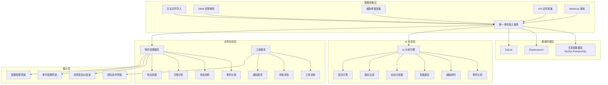
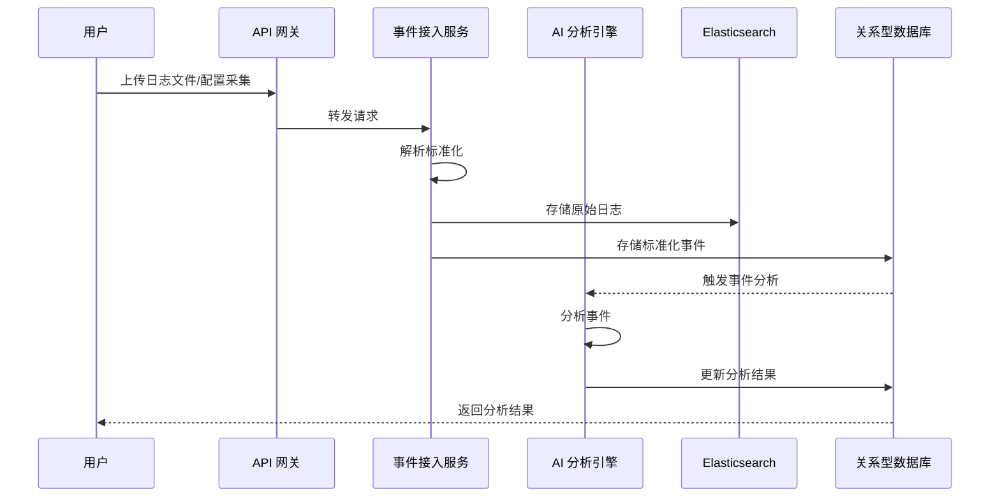

# SecOps AI Platform Technical Design

Feature Name: secops-ai-platform
Updated: 2026-03-13

## Description

SecOps AI 是一个基于 CyberStrikeAI 二次开发的安全运营协作平台，集成攻击测试与防御运营能力。平台采用微服务架构设计，基于 Go 后端 + React 前端构建，提供数据采集、事件管理、AI分析、态势感知、团队协作五大核心功能模块。

## Architecture

### 整体架构图



### 数据流架构



## Components and Interfaces

### 1. 数据采集组件

#### 1.1 事件接入服务 (Event Ingestion Service)

**职责:** 统一接收并标准化所有来源的安全数据

**接口:**

- `POST /api/v1/events/ingest` - 接收并标准化事件
- `POST /api/v1/events/batch-import` - 批量导入事件
- `GET /api/v1/events/sources` - 获取事件源列表

**依赖组件:**

- Parser Factory - 解析器工厂
- Normalizer - 数据标准化器
- Enricher - 数据 enricher (地理Location、威胁情报)

#### 1.2 采集器管理器 (Collector Manager)

**职责:** 管理各类数据采集器的配置和调度

**接口:**

- `POST /api/v1/collectors` - 创建采集器配置
- `PUT /api/v1/collectors/{id}` - 更新采集器配置
- `DELETE /api/v1/collectors/{id}` - 删除采集器
- `POST /api/v1/collectors/{id}/test` - 测试采集器连接
- `POST /api/v1/collectors/{id}/run` - 手动触发采集

**采集器类型:**

| 类型 | 配置项 | 调度方式 |
|------|--------|----------|
| FILE | 文件路径、格式类型 | 手动/定时 |
| API | 端点、认证信息、查询条件 | 定时轮询 |
| WEBHOOK | 签名密钥、解析规则 | 实时 |
| STIX/TAXII | 服务器地址、认证、Collection | 定时轮询 |
| SIEM | SIEM类型、API配置 | 定时轮询 |

#### 1.3 Webhook 服务

**职责:** 接收第三方安全工具的实时告警

**接口:**

- `POST /api/v1/webhook/{token}` - Webhook 接收端点
- `GET /api/v1/webhook/endpoints` - 获取 Webhook 端点列表

### 2. 事件管理组件

#### 2.1 事件服务 (Event Service)

**职责:** 事件全生命周期管理

**接口:**

| 方法 | 路径 | 描述 |
|------|------|------|
| GET | /api/v1/events | 查询事件列表 |
| GET | /api/v1/events/{id} | 获取事件详情 |
| PUT | /api/v1/events/{id} | 更新事件 |
| PUT | /api/v1/events/{id}/classify | 事件分类 |
| PUT | /api/v1/events/{id}/status | 更新事件状态 |
| POST | /api/v1/events/{id}/analyze | 触发 AI 分析 |
| GET | /api/v1/events/{id}/correlation | 获取关联事件 |

**事件状态:**

```
created -> triaged -> in_progress -> resolved -> closed
                  -> pending_approval -> approved/denied -> in_progress
```

#### 2.2 关联分析引擎 (Correlation Engine)

**职责:** 发现事件间的关联关系

**接口:**

- `POST /api/v1/correlation/analyze` - 分析事件关联
- `GET /api/v1/correlation/chains/{event_id}` - 获取攻击链

**关联规则:**

- IoC 匹配 (IP、域名、Hash)
- 时间窗口关联 (5分钟内)
- 资产关联 (同一主机/网络)
- TTP 模式匹配

#### 2.3 响应处置服务 (Response Service)

**职责:** 执行安全响应动作

**接口:**

- `POST /api/v1/response/actions` - 执行响应动作
- `POST /api/v1/response/playbooks` - 创建响应剧本
- `POST /api/v1/response/playbooks/{id}/execute` - 执行剧本
- `GET /api/v1/response/actions/{id}/status` - 获取动作执行状态

**响应动作:**

| 动作 | 描述 | 目标系统 |
|------|------|----------|
| isolate_host | 隔离主机 | EDR |
| block_ip | 封禁 IP | 防火墙 |
| disable_user | 禁用用户 | AD/LDAP |
| stop_service | 暂停服务 | 云平台 |
| execute_script | 执行脚本 | EDR |

### 3. AI 分析组件

#### 3.1 AI 分析引擎 (AI Analysis Engine)

**职责:** 提供智能安全分析能力

**接口:**

- `POST /api/v1/ai/analyze` - 分析事件
- `POST /api/v1/ai/judge` - 威胁研判
- `POST /api/v1/ai/suggest` - 获取智能建议
- `POST /api/v1/ai/automate` - 执行自动化处置
- `POST /api/v1/ai/report` - 生成报告
- `POST /api/v1/ai/qa` - 知识问答

**AI Prompt 模板:**

- 事件分析模板
- 威胁研判模板
- 智能建议模板
- 报告生成模板

#### 3.2 知识库服务 (Knowledge Base)

**职责:** 管理安全知识库并提供检索

**接口:**

- `POST /api/v1/knowledge/articles` - 创建知识文档
- `GET /api/v1/knowledge/search` - 搜索知识
- `POST /api/v1/knowledge/ingest` - 批量导入知识

### 4. 态势感知组件

#### 4.1 态势仪表盘服务 (Dashboard Service)

**接口:**

- `GET /api/v1/dashboard/overview` - 全局态势
- `GET /api/v1/dashboard/trends` - 趋势数据
- `GET /api/v1/dashboard/assets` - 资产态势
- `GET /api/v1/dashboard/efficiency` - 响应效能
- `GET /api/v1/dashboard/threat-intel` - 威胁情报

#### 4.2 告警聚合服务

**职责:** 实时聚合和统计告警数据

**接口:**

- `GET /api/v1/alerts/aggregation` - 获取聚合数据
- `GET /api/v1/alerts/anomalies` - 获取异常告警

### 5. 团队协作组件

#### 5.1 工单服务 (Ticket Service)

**接口:**

| 方法 | 路径 | 描述 |
|------|------|------|
| GET | /api/v1/tickets | 查询工单列表 |
| POST | /api/v1/tickets | 创建工单 |
| PUT | /api/v1/tickets/{id} | 更新工单 |
| POST | /api/v1/tickets/{id}/assign | 分配工单 |
| POST | /api/v1/tickets/{id}/transfer | 转派工单 |
| POST | /api/v1/tickets/{id}/approve | 审批工单 |
| POST | /api/v1/tickets/{id}/escalate | 升级工单 |

#### 5.2 通知服务 (Notification Service)

**接口:**

- `POST /api/v1/notifications/rules` - 创建通知规则
- `GET /api/v1/notifications/channels` - 获取通知渠道

**支持渠道:**

- 钉钉 (DingTalk)
- 飞书 (Lark)
- 邮件 (Email)
- Webhook

### 6. 集成组件

#### 6.1 EDR 集成

**支持产品:**

- CrowdStrike Falcon
- Microsoft Defender for Endpoint
- SentinelOne
- Carbon Black

**接口:**

```go
type EDRClient interface {
    GetAlerts(query AlertQuery) ([]Alert, error)
    IsolateHost(hostID string) error
    UnisolateHost(hostID string) error
    ExecuteScript(hostID string, script string) error
}
```

#### 6.2 SIEM 集成

**支持产品:**

- Splunk
- QRadar
- Elastic Security
- Microsoft Sentinel

#### 6.3 CMDB 集成

**接口:**

```go
type CMDBClient interface {
    SyncAssets() error
    GetAsset(assetID string) (Asset, error)
    SearchAssets(query string) ([]Asset, error)
}
```

## Data Models

### 事件模型

```go
type SecurityEvent struct {
    ID              string                 `json:"id"`
    Source          string                 `json:"source"`           // 事件来源
    SourceType      string                 `json:"source_type"`      // 采集器类型
    EventType       string                 `json:"event_type"`       // 事件类型
    Severity        string                 `json:"severity"`         // 严重程度: critical/high/medium/low/info
    Status          string                 `json:"status"`           // 状态
    Title           string                 `json:"title"`
    Description     string                 `json:"description"`
    RawData         map[string]interface{} `json:"raw_data"`         // 原始数据
    IoCs            []IoC                  `json:"iocs"`              // 提取的 IoC
    AssetIDs        []string               `json:"asset_ids"`        // 关联资产
    TTP             []string               `json:"ttp"`              // MITRE TTP
    AIAnalysis      *AIAnalysisResult      `json:"ai_analysis"`     // AI 分析结果
    CorrelationIDs  []string               `json:"correlation_ids"` // 关联事件
    CreatedAt       time.Time              `json:"created_at"`
    UpdatedAt       time.Time              `json:"updated_at"`
    ClassifiedAt    *time.Time             `json:"classified_at"`
    ResolvedAt      *time.Time             `json:"resolved_at"`
}

type IoC struct {
    Type    string `json:"type"`    // ip/domain/hash/email/url
    Value   string `json:"value"`
    Source  string `json:"source"`
    Updated time.Time `json:"updated"`
}

type AIAnalysisResult struct {
    Summary      string   `json:"summary"`       // 事件摘要
    AttackType   string   `json:"attack_type"`  // 攻击类型
    Confidence   float64  `json:"confidence"`   // 置信度 0-100
    Impact       string   `json:"impact"`       // 影响评估
    Suggestions  []string `json:"suggestions"`  // 建议
    TTP          []string `json:"ttp"`          // 建议的 TTP
}
```

### 工单模型

```go
type Ticket struct {
    ID            string        `json:"id"`
    EventID       string        `json:"event_id"`      // 关联事件
    Title         string        `json:"title"`
    Description   string        `json:"description"`
    Type          string        `json:"type"`          // investigation/response/approval
    Priority      string        `json:"priority"`       // P1/P2/P3/P4
    Status        string        `json:"status"`         // pending/assigned/in_progress/resolved/closed
    AssigneeID    string        `json:"assignee_id"`
    CreatorID     string        `json:"creator_id"`
    ApproverID    *string       `json:"approver_id"`    // 审批人
    SLA           time.Duration `json:"sla"`            // SLA 时长
    DueAt         *time.Time    `json:"due_at"`         // 到期时间
    CreatedAt     time.Time     `json:"created_at"`
    UpdatedAt     time.Time     `json:"updated_at"`
    ResolvedAt    *time.Time    `json:"resolved_at"`
    Timeline      []Timeline    `json:"timeline"`      // 时间线
}

type Timeline struct {
    Action     string    `json:"action"`
    UserID     string    `json:"user_id"`
    Content    string    `json:"content"`
    CreatedAt  time.Time `json:"created_at"`
}
```

### 资产模型

```go
type Asset struct {
    ID          string            `json:"id"`
    Name        string            `json:"name"`
    Type        string            `json:"type"`           // server/workstation/network/cloud
    IP          string            `json:"ip"`
    MAC         string            `json:"mac"`
    Owner       string            `json:"owner"`
    Business    string            `json:"business"`       // 业务线
    Criticality string            `json:"criticality"`    // critical/high/medium/low
    Tags        []string          `json:"tags"`
    Attributes  map[string]string `json:"attributes"`     // 扩展属性
    FirstSeen   time.Time         `json:"first_seen"`
    LastSeen    time.Time         `json:"last_seen"`
}
```

### 采集器配置模型

```go
type CollectorConfig struct {
    ID          string                 `json:"id"`
    Name        string                 `json:"name"`
    Type        string                 `json:"type"`         // file/api/webhook/stix/siem
    Enabled     bool                   `json:"enabled"`
    Config      map[string]interface{} `json:"config"`      // 类型特定配置
    Schedule    string                 `json:"schedule"`     // Cron 表达式
    LastRun     *time.Time             `json:"last_run"`
    LastStatus  string                 `json:"last_status"`  // success/failed
    CreatedAt   time.Time              `json:"created_at"`
    UpdatedAt   time.Time              `json:"updated_at"`
}
```

## Correctness Properties

### 数据一致性

- 事件状态变更必须记录完整时间线
- 工单状态与事件状态必须保持同步
- 关联分析结果必须可追溯

### 安全性

- 所有 API 必须进行身份认证
- 敏感操作必须记录审计日志
- Webhook 接收必须验证签名

### 可靠性

- 采集器失败必须自动重试 (最多 3 次)
- AI 分析超时设置为 60 秒
- 响应动作执行必须记录完整日志

### 性能

- 事件查询响应时间 < 500ms
- 仪表盘加载时间 < 2 秒
- 批量导入支持 10,000+ 事件

## Error Handling

### 采集器错误

| 错误类型 | 处理策略 |
|----------|----------|
| 认证失败 | 标记采集器状态为 failed，发送通知 |
| 网络超时 | 自动重试 3 次，间隔指数增长 |
| 解析失败 | 记录原始数据到错误队列，等待人工处理 |

### AI 分析错误

| 错误类型 | 处理策略 |
|----------|----------|
| API 超时 | 返回超时错误，允许用户重试 |
| API 限流 | 自动排队等待重试 |
| 分析失败 | 记录错误日志，返回降级结果 |

### 响应动作错误

| 错误类型 | 处理策略 |
|----------|----------|
| 目标系统不可达 | 标记动作失败，发送通知 |
| 权限不足 | 标记需要授权，提示配置检查 |
| 执行超时 | 返回超时状态，支持重试 |

## Test Strategy

### 单元测试

- 解析器测试 - 验证各格式解析正确性
- 标准化测试 - 验证数据标准化逻辑
- 关联规则测试 - 验证关联算法准确性

### 集成测试

- 采集器测试 - 验证各类型采集器功能
- API 集成测试 - 验证接口正确性
- 第三方集成测试 - EDR/SIEM API 对接

### E2E 测试

- 完整事件流程 - 从采集到归档
- AI 分析流程 - 事件分析到报告生成
- 团队协作流程 - 工单流转到通知

## References

- [CyberStrikeAI 项目](https://github.com/Ed1s0nZ/CyberStrikeAI)
- [STIX 2.1 规范](https://oasis-open.github.io/cti-documentation/stix/versions)
- [TAXII 2.1 规范](https://oasis-open.github.io/cti-documentation/taxii/versions)
- [MITRE ATT&CK](https://attack.mitre.org/)
